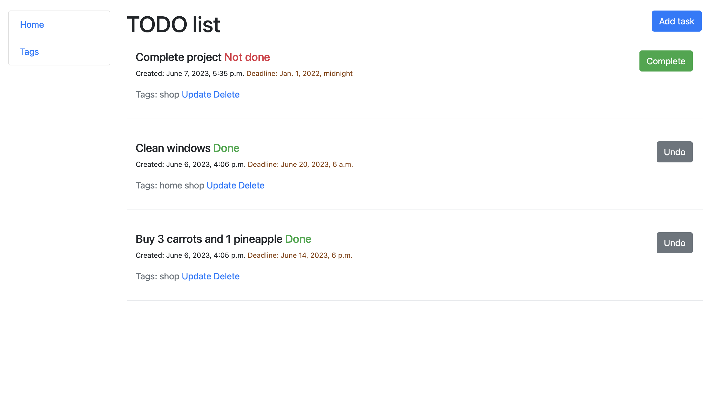

# TODO list

This is a small project written in Django for the purpose of learning.\
TODO list works in such a way that you can create a tag to which you can add a specific task that
may have a deadline, you can also change the status of the task.

## Installation

Follow these steps to install and run the project:

1. Clone the repository:\
` git clone https://github.com/ArtMot99/todo-list.git `
2. Change to the project directory:\
` cd todo-list `
3. Install and activate the virtual environment:\
` python3 -m venv venv & source venv/bin/activate `
4. Install dependencies:\
` pip install -r requirements.txt `
5. Make migrations:\
` python manage.py migrate `


## Project setup:

Before starting the project, you will need to create an .env file to store your environment variables.\
Create an .env file in your project root directory and fill it like this:

```
DJANGO_SECRET_KEY=your-secret-key
DEBUG=1
ALLOWED_HOSTS=localhost,127.0.0.1
```

Please replace **your-secret-key** with your Django secret key.


## Start

Run the following command to start the project:

` python manage.py runserver  `


## Contacts

If you have any questions please contact me via email: **motrunich2013@gmail.com**\
Repository: https://github.com/ArtMot99/todo-list.git


## Demo


